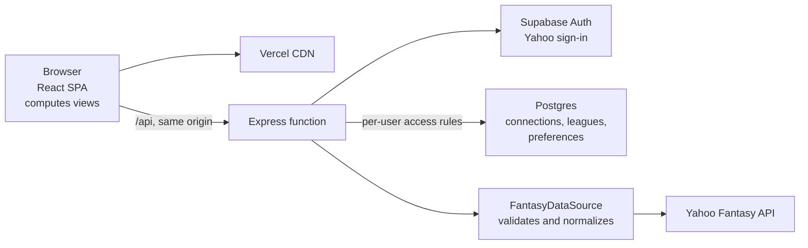
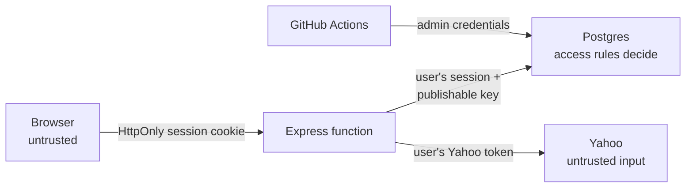
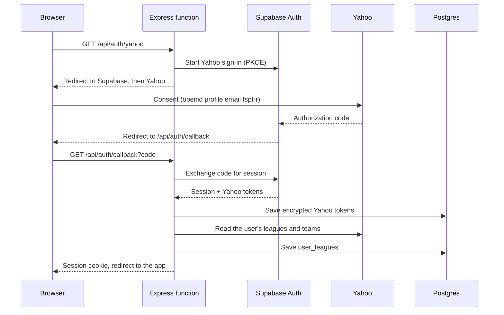
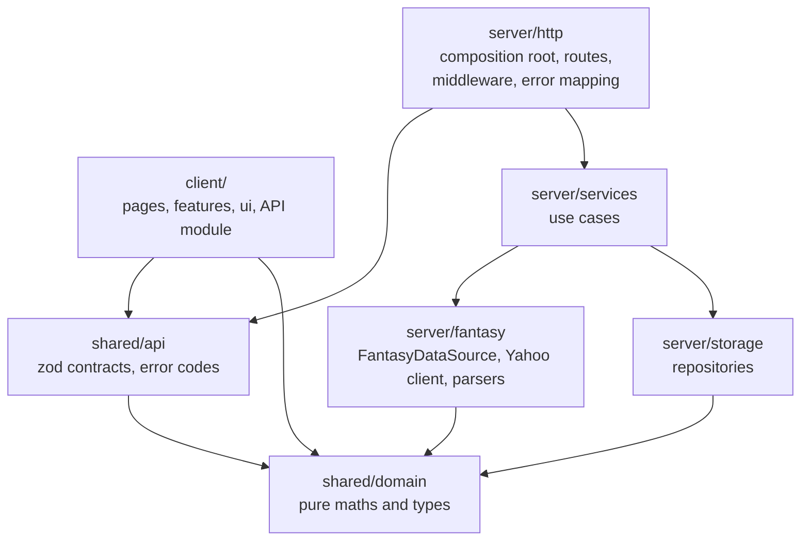
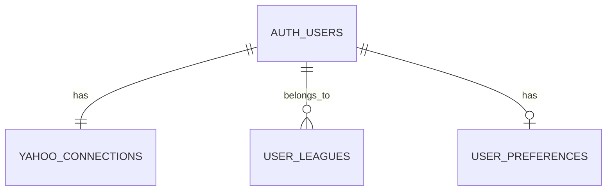
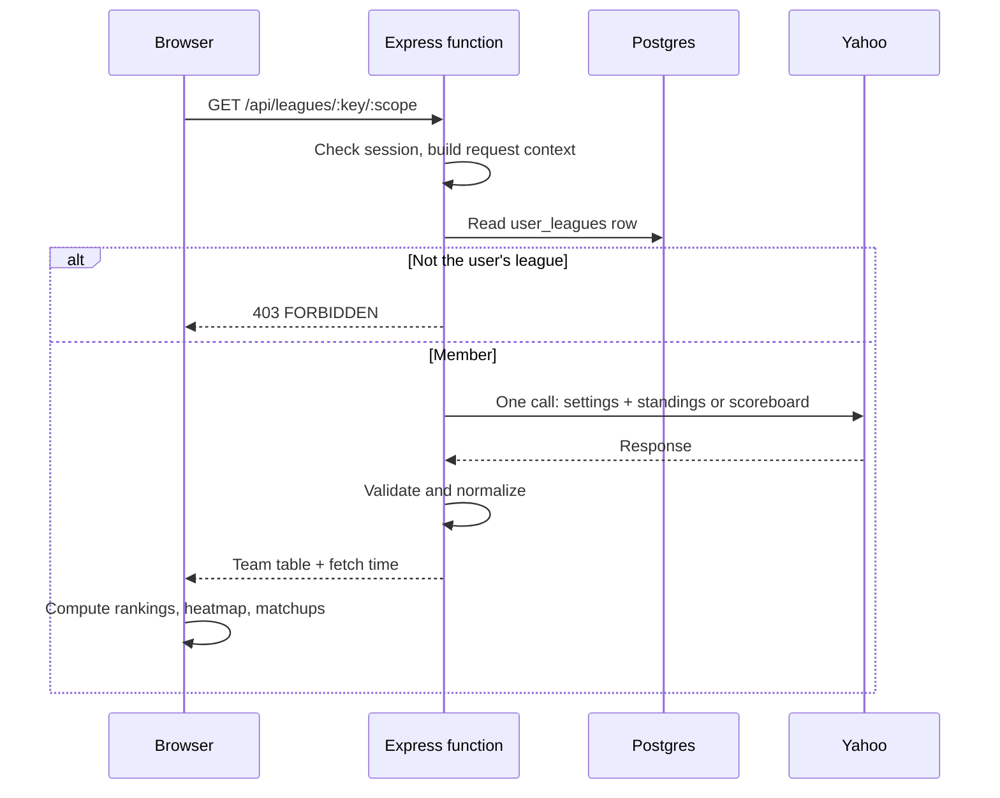
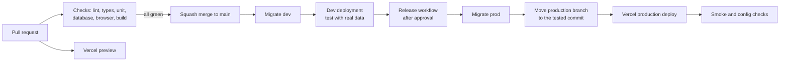

# Pikachu Basketball target state

**As of 2026-10-10.** The agreed end state for how Pikachu Basketball is built, run and delivered. It is the single source of truth for the architecture: other docs, `AGENTS.md` and new code follow it. Parts of today's code predate it. Changes to it are made by pull request, with a line added to [the changelog](target-state-changelog.md).

Constraints: React/Vite and Express, Vercel and Supabase, Yahoo-only sign-in, at most 14 concurrent users, free plans.

## Overview

A single Vercel project serves the React app and an Express API from one origin. Supabase provides Yahoo sign-in and a small Postgres database whose access rules keep each user's data private. Yahoo's Fantasy API is the only source of fantasy data and is read live; the database holds only what Yahoo can't return on demand. The server returns one table of team stats per league and scope, and the client computes every view from it. GitHub holds everything that defines the system, and nothing reaches production without passing its checks.

### Product scope

- Sign in with Yahoo and sign out; disconnect Yahoo; delete the account and everything stored for it.
- Pick one of the user's Yahoo fantasy basketball leagues, grouped by season and labelled preseason, active or finished; return to the last one used. A header always shows the season, league and the user's team.
- Rankings for the season or any week, with a category heatmap.
- The current matchup, and the selected team compared against every other team.
- The selected team's roster, with the date it applies to.
- Phone and desktop layouts, light and dark themes.

Supported leagues are Yahoo head-to-head category leagues using the standard nine categories: FG%, FT%, 3PM, PTS, REB, AST, STL, BLK and TO. Other scoring formats show an "unsupported scoring" message instead of guessed rankings. All Yahoo access is read-only. Chat, AI assistance, NBA scheduling and draft tools are out of scope.

### Principles

1. **Git defines the system.** Code, schema, routing and settings are in the repo. Dashboard-only settings are checked against the repo automatically.
2. **Only checked changes reach production.** Every change goes through a pull request with passing checks, and every deploy is verified.
3. **Environments stay apart.** Each has its own database, users, keys and secrets. The few shared items are named, justified and guarded.
4. **Yahoo is the source of truth.** Fantasy data is read live. The app stores only tokens, each user's leagues and their preferences.
5. **Yahoo's format stops at the boundary.** Everything behind `FantasyDataSource` works with typed, validated data.
6. **Pure core, thin edges.** Fantasy logic is pure functions; I/O sits in small adapters that are passed in, never reached for.
7. **Stay small.** Free plans, one serverless function, one small database, no background jobs in the app. Add infrastructure only for a measured need.

## System

### Platforms

| Platform | Role | Why it fits |
|---|---|---|
| GitHub | Source, reviews, security scanning | Free for a public repo, including code and secret scanning; Vercel and Supabase integrate with it directly |
| GitHub Actions | Checks, deploy jobs and all scheduled work | Runs the full test suite, including a throwaway Supabase database, at no cost |
| Vercel | Hosting for the SPA and Express API | Supports Vite and Express directly; one origin; a preview per branch; one-click rollback |
| Supabase Auth | Yahoo sign-in and sessions | Handles the security-sensitive parts of OpenID Connect and hands the app the Yahoo tokens at sign-in |
| Supabase Postgres | Per-user storage | The database enforces that users see only their own rows, tested in CI |
| Yahoo Fantasy API | All fantasy data | The only source for private league data; one registered app, `PikachuBball` |

### Trust boundaries

- **The browser is untrusted.** It never sees tokens, and every key it sends is checked on the server.
- **The server holds** the publishable Supabase key, the token encryption key and the Yahoo client secret, and acts as the signed-in user. It never holds the Supabase admin key, so the database's access rules apply to everything it does.
- **Admin credentials** exist only in GitHub environments, for migrations and scheduled jobs.
- **Stored rows limit, Yahoo decides.** Users can write their own rows through Supabase's Data API, so a stored league only limits what the server will request; Yahoo decides what the user can actually read. For the same reason, no stored data is shared between users.
- **Yahoo responses are untrusted input** and are validated before use.
- **Tokens** are encrypted with AES-256-GCM, bound to their owner and purpose, and refreshed with a version check so racing refreshes can't overwrite each other.
- **Sessions** are HttpOnly, Secure, SameSite=Lax cookies. Every API response is private and uncacheable.
- **Security headers** on every response: a strict Content Security Policy allowing only the app's own origin, HSTS, `X-Content-Type-Options: nosniff`, a same-origin referrer policy and no framing.

### Sign-in and Yahoo tokens

- **One sign-in.** Signing in with Yahoo through Supabase both creates the app session and grants Fantasy read access (`fspt-r`); there is no separate "connect Yahoo" step.
- **Identity** is the verified Yahoo subject from the `custom:yahoo` provider with issuer `https://api.login.yahoo.com`, never an email match. The stored Yahoo identity must belong to the signed-in Supabase user.
- **League sync never blocks sign-in.** If reading the user's leagues fails during the callback, sign-in still completes and the leagues are fetched on the first request for them.
- **Refresh.** Within a minute of expiry, the server refreshes the Yahoo access token with the client secret and saves it with a version check. If another instance refreshed first, the server uses that token. A rejected refresh means `YAHOO_RECONNECT_REQUIRED`, and the user signs in again.
- **Sign-out** ends the Supabase session. **Disconnect** also revokes the grant at Yahoo and deletes the stored tokens and leagues; a refresh already in flight can't write them back. **Account deletion** goes through a database function a signed-in user can run only on their own account; it removes their Supabase user and, through cascading deletes, every row they own.

### Configuration

One zod schema parses all configuration once at startup in the composition root; the app refuses to start if anything is missing or malformed.

| Variable | Holds | Secret |
|---|---|---|
| `APP_ORIGIN` | The app's public origin, for redirects | No |
| `SUPABASE_URL`, `SUPABASE_PUBLISHABLE_KEY` | The environment's Supabase project | No; the key is public by design |
| `ENCRYPTION_KEY`, `ENCRYPTION_KEY_VERSION`, `ENCRYPTION_KEY_PREVIOUS` | 32-byte keys for stored Yahoo tokens: the current one with its version number (default 1, raised by one at each rotation), and the previous one (the version below) only during a rotation | Yes; one per environment |
| `YAHOO_CLIENT_ID`, `YAHOO_CLIENT_SECRET` | The `PikachuBball` app, for token refresh | The secret is; shared by dev and prod |
| `YAHOO_PROVIDER_REDIRECT_URI` | The Supabase callback registered with Yahoo | No |
| `NODE_ENV`, `TRUST_PROXY` | Runtime mode and proxy handling | No |

### Environments

| Environment | Purpose | Supabase | Yahoo | Who signs in |
|---|---|---|---|---|
| Local | Development and tests on a laptop | Throwaway local database | Stand-in that replays recorded responses | Test users |
| CI | The same tests on every pull request | Throwaway local database | Stand-in | Test users |
| Preview | A build of each feature branch, as a build check | None | None | Nobody |
| Dev | Hosted deployment of `main`: every merged change is tested here with real Yahoo data before release | `Pikachu Basketball Development` | `PikachuBball` | The owner only |
| Prod | Deployment of the `production` branch, for the league | `Pikachu Basketball` | `PikachuBball` | League members |

#### Local development

- `npm ci` and `npm run dev` run the whole app on a laptop against the throwaway Supabase stack and the Yahoo stand-in. No hosted credentials are needed or kept locally.
- **The Yahoo stand-in** replays recorded responses through the real transport, and can also simulate timeouts, 429s, 5xx errors and expired tokens.
- **Recorded responses** are captured from the dev deployment by a repo script, scrubbed of names and personal details, and refreshed each season.
- **A seed script** creates two synthetic users with leagues; the browser tests use the same seed.

#### Separation

Each environment has its own database, users, encryption key, sessions, redirect allowlist and secrets. A credential from one environment doesn't work in another.

| Resource | Local / CI | Preview | Dev | Prod |
|---|---|---|---|---|
| Database and users | Throwaway | None | Dev project | Prod project |
| Encryption key | Fixed test value | None | Dev only | Prod only |
| Supabase admin credentials | Local only | None | GitHub `dev` environment | GitHub `production` environment, approval required |
| Sign-in redirect allowlist | Local callback | None | The dev deployment's callback | The production callback only |
| Yahoo app and secret | None | None | `PikachuBball` (shared with prod) | `PikachuBball` |
| Vercel variables | — | No Supabase or Yahoo values | Preview scope, `main` branch only | Production scope only |

**Shared by necessity.** Yahoo grants Fantasy access to one app only, so dev and prod share its secret, its rate limit and its revocation switch. Safeguards:

- The dev copy of the secret exists only in Vercel's `main`-branch settings and the owner's password manager.
- If it's exposed, regenerate it in Yahoo and update prod first, then dev.
- Dev traffic stays manual and light; nothing automated calls Yahoo from dev. The dev deployment is behind Vercel Authentication, so only the owner can open it.
- Dev holds only the owner's own account, and its data can be wiped at any time.

## Code

### Layout and dependency rules

The code is organized by concern. A lint rule enforces which module may import which.

| Module | May import | Never |
|---|---|---|
| `shared/domain` | Nothing | I/O, Express, React, Yahoo shapes |
| `shared/api` | `shared/domain`, zod | Server or client code |
| `server/fantasy` | `shared/` | HTTP, storage. It is the only code that knows Yahoo's format |
| `server/storage` | `shared/` | HTTP, Yahoo |
| `server/services` | `shared/`, the interfaces of `server/fantasy` and `server/storage` | HTTP; concrete implementations |
| `server/http` | Everything on the server, `shared/` | Business logic in routes or middleware |
| `client/` | `shared/` | `server/`; `fetch` outside the API module |

### Server

- **Where computation lives.** Yahoo parsing lives in `server/fantasy`, behind `FantasyDataSource`, which returns validated domain types. Fantasy maths (category ranks, totals, heatmap values, head-to-head results, percentages from makes and attempts) is pure functions in `shared/domain`, run on the client. The server checks access, fetches, normalizes and returns the team table; it builds no view-specific responses.
- **Use cases.** Each endpoint maps to one service function (list leagues, get a league scope, get a roster, disconnect) that takes the request context and its inputs.
- **Per-request context.** Middleware builds one context per request: the signed-in user, owner-scoped repositories, one lazily created Yahoo client, the clock and a logger carrying the request id. Code receives it as an argument. Nothing lives in module-level state, so any number of serverless instances behave the same, and tests can replace the clock and Yahoo.

### Client

- **Routes.** `/auth` for sign-in and the league view for everything else. The URL holds the selected league, team and scope, so refresh, back and shared links work; the saved preference only chooses where a new visit starts.
- **Data access.** One typed API module makes every request and checks responses against `shared/api`. Hooks (`useMe`, `useLeagues`, `useLeagueScope`, `useRoster`) wrap it; components never fetch. Views derive their data from the team table with `shared/domain` functions inside memoized hooks.
- **Components.** `pages/` compose features; `features/` render one part of the product from prepared data; `ui/` holds the shared primitives. Components contain no fantasy maths.
- **Every data view distinguishes its states:** loading (a skeleton); no leagues; preseason, with no stats yet; unsupported scoring; partial data; each error in the Errors table; and loaded, with an "updated N min ago" label and a refresh button. Nothing incomplete or old is presented as complete and current.
- **One error boundary** at the root shows a recoverable error page with the request id instead of a blank screen.

| State | Owner |
|---|---|
| Data from the API | TanStack Query, with keys from one factory that mirrors the API (`me`, `leagues`, league + scope, roster) |
| Selected league, team and scope | The URL |
| Sorting, chosen opponent, open panels | Local component state |
| Preferences that follow the user | The server, through the API |

### Code quality and design

#### Design approach

**Functional core, thin adapters.** Domain logic is pure functions over plain data. Classes are used for adapters that hold state or connections (the Yahoo client, repositories, the cipher) and are combined by composition. Inheritance is used only for error types.

| Unit | Does | Doesn't |
|---|---|---|
| Route | Maps a URL to middleware and a controller | Contain logic |
| Middleware | Session, request context, access checks, rate limits | Call Yahoo or business logic |
| Controller | Parses input with the endpoint's schema, calls one service, sends the result | Check auth again, build responses by hand, catch errors |
| Service | Runs one use case through injected interfaces | Know about HTTP or Yahoo's format |
| `FantasyDataSource` | Turns Yahoo responses into domain types | Make access decisions or store data |
| Repository | Reads and writes one table, returns domain types | Contain business rules |
| `shared/domain` function | Computes from its arguments | Perform I/O or read the clock |

#### Yahoo integration structure

| Part | Responsibility |
|---|---|
| Token manager | Loads and decrypts the user's tokens once per request, refreshes them with the version check, and saves the result |
| Transport | Sends authenticated HTTP requests to Yahoo through the request policy; knows nothing of fantasy resources |
| Resources | One method per Yahoo call in the calls table; each validates the response with a zod schema |
| Parsers | Pure functions from validated Yahoo responses to domain types, tested against recorded responses |
| `FantasyDataSource` | The interface the rest of the server uses; composes the parts above |

#### Dependency injection

- **One composition root.** The app factory in `server/http` is the only code that reads configuration and constructs implementations. At startup it builds the process-wide pieces: configuration, token cipher, Yahoo transport and logger. Per request, middleware assembles the request context from them.
- **Constructor injection.** Classes receive their collaborators through the constructor, typed as interfaces; functions receive them as arguments. No other module imports configuration, creates its own Yahoo client or storage, or uses a global logger.
- **Required means required.** A dependency is never optional in a signature and then checked at runtime.
- **Plain wiring.** The composition root is ordinary code; no dependency-injection library.

| Interface | Implementation | In tests |
|---|---|---|
| `FantasyDataSource` | Yahoo data source | Replays recorded Yahoo responses |
| Repositories (connections, leagues, preferences) | Supabase, as the signed-in user | The throwaway database |
| `TokenCipher` | AES-256-GCM | Fixed test key |
| `Clock` | System clock | Fixed clock |
| `Logger` | JSON logger with request id | In-memory logger |

#### Types and errors

- **Strict types.** TypeScript strict mode and no `any`. External data (Yahoo responses, request input, database rows, configuration) enters as `unknown` and crosses into typed code only through a zod schema.
- **Errors carry meaning, not HTTP.** Domain and integration errors are typed errors with a code from `shared/api`; only `server/http` maps codes to HTTP status.
- **No silent defaults.** Missing or malformed Yahoo fields fail validation instead of falling back to guessed values.
- **No swallowed errors.** A `catch` either handles a known case or converts the error to a typed one; it never hides a failure.

#### Clean code

- **Small units.** Functions stay short and single-purpose; files stay focused on one concern. Lint enforces at most 60 lines per function, a cyclomatic complexity of 10 and 400 lines per file.
- **Names say what things are,** in the product's terms (league, scope, team table, category). Server files use kebab-case; React components use PascalCase.
- **No dead code.** No placeholders, commented-out code, unused exports or debug endpoints.
- **Comments explain why,** not what. Every exported function and interface has a one-line doc comment.
- **Logging at boundaries only:** one line per request and one per Yahoo call, never inside loops or parsers.

#### Conventions

- **Formatting** is done by Prettier and checked in CI, so style is never a review topic.
- **Dependencies.** Node 24 and npm 11 are pinned, the lockfile is committed and installs use `npm ci`. Platform APIs come first (the built-in `fetch` rather than an HTTP library), every package has a reason to exist, and unused packages fail CI (knip).
- **Async.** Every external call has a timeout and an abort signal. The client cancels requests the user has navigated away from, and the server passes cancellation through to Yahoo. Independent calls run in parallel; nothing is fire-and-forget.
- **Time.** The server works in UTC through the injected clock; weeks follow Yahoo's boundaries; the client shows dates in the user's time zone.
- **Numbers.** Stats stay exact until display. Rounding happens only when formatting, with one formatter per kind of stat.
- **Immutability.** Domain data is typed `readonly`; functions return new values instead of changing their inputs.
- **No secrets in the client.** Nothing secret is built into the browser bundle; the client needs no configuration beyond its own origin.

#### Enforcement

- **Lint (ESLint) fails the build** on: the dependency rules, `any`, unhandled promises, unused code, and the size and complexity limits. Prettier and knip run in the same step.
- **Type checking** with `tsc` in strict mode.
- **Coverage thresholds** enforced in CI: 90% of lines in `shared/domain` and `server/fantasy`, 80% overall.
- **Every bug fix** comes with a test that fails without it.

## Testing

### Testing by layer

| Layer | Tests | Against |
|---|---|---|
| `shared/domain` | Every calculation and fantasy rule: ties, zero attempts, missing values, turnovers, unsupported scoring | Hand-built team tables; no I/O |
| `server/fantasy` | Parsing and normalizing, and that the output passes the `shared/api` schemas | Recorded Yahoo responses |
| `server/storage` and access rules | Each user sees and changes only their own rows; token refresh races | The throwaway Supabase database |
| `server/services` and `server/http` | Each route's status codes, error codes and response schema | A stand-in `FantasyDataSource` and the throwaway database |
| `client/` | Components, hooks and every data state; main flows in a browser at phone and desktop widths | Recorded API responses |

### Testing practices

- **Shape.** Most tests are fast unit tests of `shared/domain` and the parsers; fewer route and database tests; a small set of browser flows.
- **Deterministic.** A fixed clock, no real network (an unhandled request fails the test), no state shared between tests and no sleeps.
- **Behaviour, not implementation.** Tests are named for the behaviour they check, go through public interfaces, and build their data with small builder functions.
- **Contracts.** Recorded Yahoo responses must pass the parsers and the `shared/api` schemas, and client tests use responses that pass the same schemas, so server and client can't drift apart.
- **Security.** Cross-user reads and writes, forged league and team keys, a replayed sign-in callback, and disconnect during a token refresh all fail as intended.
- **Failures.** Yahoo timeouts, 429s, 403s, 5xx errors and malformed responses each produce the expected state and error code.
- **Browser.** Playwright runs the main flows against the production build with the Yahoo stand-in, at 390 px and desktop widths, with automated accessibility checks (axe).
- **No flaky tests.** A failing test is never retried automatically, skipped or quarantined; the test or the code is fixed.
- **Before each release,** a load test of 14 simultaneous users against the Yahoo stand-in checks the speed target and the Yahoo call count per view.

## Data and Yahoo integration

### The team table

Every view (season and weekly rankings, the heatmap, the current matchup and the comparison against every team) is computed from one table: each team's nine category totals, with field-goal and free-throw makes and attempts, for one scope. A scope is the season, the current week or a past week. The table comes with the league settings (categories, weeks, current week, finished flag) and the teams and managers; a week's table also has that week's matchup pairings.

### Fantasy rules

- **Categories and their directions** come from the league's settings and are checked against the supported nine-category format.
- **Category ranks** are competition ranks: equal values share a rank and the next rank is skipped (1, 1, 3). Turnovers rank ascending; the other eight categories rank descending.
- **The overall ranking** is the sum of category ranks, labelled "Category rank sum — lower is better" so it isn't mistaken for Yahoo's official standings. Tied sums stay tied.
- **Percentages** are total makes divided by total attempts, never an average of percentages. Zero attempts means the percentage is unavailable.
- **Missing is not zero.** An absent or invalid value is unknown. When a value a calculation needs is unknown, that rank, total or win/loss result is shown as unavailable rather than computed from partial data.
- **Official matchup results** are Yahoo's. The comparison against other teams is labelled as a comparison of observed totals, not a prediction.
- **Seasons and weeks** come from Yahoo's game keys and week boundaries, never from a fixed calendar or week count.

### Yahoo calls

Yahoo data is grouped by how often it changes. Data that changes about once a season is stored; everything else is read live when viewed.

| Data | Changes | Yahoo call | When |
|---|---|---|---|
| The user's leagues and teams | About once a season | `/users;use_login=1/games;game_codes=nba/teams` and `/users;use_login=1/games;game_codes=nba/leagues`, together | At sign-in, when the user refreshes their leagues, and at season rollover; the result is stored |
| League settings | Before the draft, then weekly for the current week | Included in every table call below | With the stats |
| Season table | While NBA games are live or being finalized | `/league/{key};out=settings,standings` | When the season scope is viewed |
| Current week table | While NBA games are live or being finalized | `/league/{key};out=settings,scoreboard` | When the current week is viewed |
| Past week table | Never, once stat corrections settle | `/league/{key};out=settings/scoreboard;week={n}` | When that week is viewed |
| Roster | Trades and injury news, a few times a week | `/team/{key}/roster` | When the roster view is opened |

- **One call per response.** Settings and stats arrive together, so a response never mixes data from different moments, and the current week and season status come with the stats.
- **Access before Yahoo.** A league that isn't in the user's stored leagues is refused without calling Yahoo.
- **Two calls for the user's leagues.** The teams call has the user's team in each league but no league name or draft state; the leagues call has those but no team. Both are fixed-cost, whatever the number of leagues. A league is finished when Yahoo marks it or its game over, preseason when it hasn't drafted or starts after today in US Eastern time, and active otherwise.

### Yahoo request policy

- **Time limits:** 8 seconds per attempt and 20 seconds for the whole request, inside Vercel's 30-second function limit.
- **Retries:** up to 3 attempts for timeouts, network errors and Yahoo 5xx responses, with exponential backoff from 250 ms. A 429 waits for Yahoo's `Retry-After` when it fits the budget.
- **Outcomes:** a rejected token becomes `YAHOO_RECONNECT_REQUIRED`; a 429 that doesn't fit becomes `YAHOO_RATE_LIMITED`; anything else that fails becomes `YAHOO_UNAVAILABLE`.

### Stored data

| Table | Holds |
|---|---|
| `yahoo_connections` | One per user: Yahoo identity (bound to the signed-in Supabase identity), encrypted tokens, expiry, token and key versions |
| `user_leagues` | One per league the user belongs to: league key, the user's team key, season, name, whether it's finished, when it was last synced |
| `user_preferences` | Selected league, team and display choices |

- Stats, standings, scoreboards and rosters are never stored on the server. No raw Yahoo payloads and no other managers' personal details are kept. The whole league is under 100 rows.
- Deleting an account deletes every row the user owns.
- Every table has per-user access rules, tested in CI. Token writes go through database functions that enforce the version check.
- All schema changes are migrations in git, backward compatible with the running app, and tested in CI against a throwaway database.

### Caching

- **Browser:** TanStack Query holds each league and scope for the session, so moving between views and weeks doesn't call Yahoo again. A refresh button fetches again. Each response carries its fetch time, shown as "updated N min ago".
- **Server:** none.
- **CDN:** caches only the built static assets, never `/api`.

### Expected load

| Visit | Yahoo calls |
|---|---|
| Open rankings, or switch to a week not yet viewed | 1 |
| Current matchup and comparison against every team | 0: computed from the same table |
| A scope already viewed this session | 0 |

With 14 users at about 30 views a day, that is under 1,000 calls a day for the shared Yahoo app.

## API

| Endpoint | Returns |
|---|---|
| `GET /api/auth/yahoo`, `GET /api/auth/callback`, `POST /api/auth/logout` | Sign-in and sign-out |
| `GET /api/me` | The user, whether their Yahoo connection works, and their preferences |
| `DELETE /api/me/yahoo` | Disconnects Yahoo and deletes stored tokens and leagues |
| `DELETE /api/me` | Deletes the account and everything stored for it |
| `GET /api/leagues` | The user's leagues and teams, optionally refreshed from Yahoo |
| `PUT /api/me/preferences` | Saves the selected league, team and display choices |
| `GET /api/leagues/:key/:scope` | The team table for `season`, `current` or a week number, with settings, teams, matchup pairings and fetch time |
| `GET /api/leagues/:key/teams/:team/roster` | One team's roster |
| `GET /api/health` | Deployment health |

- **Contracts.** Each endpoint has one zod schema in `shared/api` for its input and its output, checked by the server and by the client's API module.
- **Surface.** Only these endpoints exist.
- **Limits.** Each user may make 60 data requests a minute and refresh their league list from Yahoo once a minute; beyond that the API returns `RATE_LIMITED` with `Retry-After`.
- **Logs.** Structured JSON with a request id on every line, including each request's Yahoo call count, duration and rate-limit errors. Logs never contain tokens or Yahoo response bodies.

### HTTP conventions

- **Methods mean what they say.** `GET` only reads; `PUT` and `DELETE` change state and can be repeated safely.
- **Same-origin writes.** Requests that change state are rejected unless their `Origin` header is the app's own origin. Together with SameSite=Lax cookies, this blocks cross-site request forgery.
- **JSON in and out.** Every error body is `{ code, message, requestId }`.
- **Request ids.** The server assigns one to each request, returns it in `X-Request-Id`, and logs it.
- **No API versions.** The client and API ship together. Each response carries the build id; when it differs from the client's own, the client reloads after the current action, so an old tab never keeps talking to a newer API.
- **Health.** `GET /api/health` returns status and the deployed commit without touching the database or Yahoo, so checking it never wakes the database or spends Yahoo quota. The smoke check uses the commit to confirm the right build is live.

### Request flow

### Errors

One set of codes in `shared/api`, turned into HTTP responses in one place on the server and into screens in one place on the client.

| Code | HTTP | The user sees |
|---|---|---|
| `UNAUTHORIZED` | 401 | The sign-in page |
| `YAHOO_RECONNECT_REQUIRED` | 401 | A "Sign in with Yahoo again" prompt |
| `FORBIDDEN` | 403 | The league picker |
| `VALIDATION_ERROR` | 400 | A generic error |
| `RATE_LIMITED`, `YAHOO_RATE_LIMITED` | 429 | "Too many refreshes, try again in a minute" |
| `YAHOO_UNAVAILABLE` | 503 | "Yahoo isn't responding" with a retry button; data already on screen stays |
| `INTERNAL_ERROR` | 500 | A generic error with the request id |

## Quality targets

| Area | Target |
|---|---|
| Speed | A league view loads in under 2 seconds on a phone in normal conditions; switching between views of a loaded scope is instant |
| Size | Initial JavaScript under 200 KB gzipped; charts and secondary views load when first needed |
| Degradation | When Yahoo fails, the user sees a clear message and keeps what is on screen; nothing hangs past 20 seconds |
| Accessibility | WCAG 2.1 AA contrast in both themes, full keyboard use, labelled controls, charts with a text alternative, touch targets of at least 44 px, and no meaning carried by colour alone (wins, losses and ties are also shown as text) |
| Devices | Current Safari and Chrome on phones from a 390 px width, and current desktop browsers; only stat tables scroll sideways |
| Privacy | No analytics or third-party scripts; only the data listed under Stored data is kept |

## Delivery

- **Protected main branch.** Changes arrive only through pull requests with every check green. Squash merges only, no force pushes, and branches are deleted after merge.
- **Checks on every pull request:** lint (including the dependency and code-quality rules), type checking, unit tests with coverage thresholds, database access-rule tests, browser tests of the main flows at phone and desktop widths, and a production build.
- **Two stages.** Merging to `main` migrates the dev database and deploys the dev environment, where the change is tested with real data. A manual release then migrates prod and moves the `production` branch to the tested commit, which Vercel deploys. Only tested commits reach production.
- **Migrations are backward compatible,** so the app and the database can update in either order.
- **After each deploy,** a smoke check confirms the app is up, protected routes refuse anonymous requests, deep links load, and security headers are present. A failure means rolling back to the previous deployment.
- **Config checks** compare each environment against the repo without reading secret values: the Yahoo sign-in provider and scopes; the redirect allowlist; that the schema matches the migrations; that the expected Vercel variables exist in each scope.
- **Supply chain.** Dependabot security alerts and weekly grouped updates, secret scanning with push protection, and CodeQL.
- **Pull requests** are small and single-purpose, linked to a Linear issue, titled `type: summary (issue)` with types `feat`, `fix`, `refactor`, `test`, `docs` and `chore`, and say how the change was verified.

### Release mechanics

| Piece | Setup |
|---|---|
| Branch rulesets | `main`: pull requests with all checks green, squash only. `production`: only the release workflow can move it, and only fast-forward. |
| GitHub environments | `dev` holds the dev database credentials. `production` holds the prod database credentials and the deploy key that moves `production`; its jobs wait for the owner's approval and run only from `main`. |
| Vercel | Git integration. `production` is the production branch. `main` deploys with dev settings scoped to that branch. Vercel reports each deployment back to GitHub, which triggers the smoke check. |
| Supabase | The Supabase CLI runs migrations from the workflows (`supabase db push`), in a fixed order with logs in GitHub and the prod run behind the approval. |
| Releases | Each release is a tag (for example `v2026.10.1`) with a GitHub Release whose notes are generated from merged pull request titles. |

#### Workflows

1. **On merge to `main`:** migrate the dev database. Vercel deploys `main` to dev; when it reports success, a smoke check runs against the dev URL.
2. **Release** (started with Run workflow after testing in dev): wait for approval → migrate the prod database → move `production` to the tested commit → tag it and publish the release notes. Vercel deploys production; when it reports success, the smoke and config checks run, and a failure rolls back to the previous production deployment.
3. Only one release runs at a time.

**Secrets,** all in GitHub environments: a Supabase access token, the dev and prod database passwords, and the deploy key for `production`. No Vercel token is needed.

## Operations

- **Scheduled work runs in GitHub Actions:** the weekly keep-alive, the weekly schema dump and the config checks. None of it calls Yahoo. The app does work only when a user makes a request.
- **Staying awake.** The weekly keep-alive reads from the prod database so the free project doesn't pause in the off-season.
- **Season rollover.** When every stored league is finished, the next visit refreshes the user's leagues from Yahoo, which picks up the new season; while Yahoo still lists only finished leagues, it asks again at most once a day. A league's stored row is removed once Yahoo no longer lists it.
- **Observability.** Vercel keeps the function logs. Each request's line carries its request id, route, status, duration and Yahoo call count, so a user's error message can be traced to its log line. Yahoo rate-limit errors and slow requests are the signals reviewed for the revisit triggers.
- **Key rotation.** Each stored token records its encryption key version. Rotating sets a new `ENCRYPTION_KEY` and moves the old one to `ENCRYPTION_KEY_PREVIOUS`; new writes use the new key, tokens are re-encrypted at their next refresh, and the previous key is removed once no row uses it.
- **Notifications.** Failed checks, deploys, smoke checks and config checks notify the owner through GitHub. There is no paging.
- **Runbooks** in `docs/runbooks/` cover: Yahoo secret exposure, encryption key rotation, restore and rollback, Yahoo sign-in provider setup, and the season rollover check.
- **Settings that live in dashboards** (the Yahoo sign-in provider, Yahoo redirect URIs, Vercel variables) are changed with repo scripts where possible and always verified by the config checks.
- **Yahoo registration** is one app, `PikachuBball`, whose redirect URIs are exactly the Supabase callbacks in use. An inventory of app IDs, redirect URIs and scopes is kept in the repo and rechecked each season.
- **Recovery.** Supabase Free has no backups; the app is designed so none are needed. Lost Yahoo tokens mean the user signs in again; lost league lists are fetched again from Yahoo; lost preferences mean choosing the league again. A weekly schema dump is kept as a CI artifact, and a written runbook covers restore and rollback.

## Decisions

| Area | Chosen | Not chosen |
|---|---|---|
| Fantasy data | Read live from Yahoo; cached only in the browser for the session | Server snapshots with expiry rules: fewer Yahoo calls and data during outages, but a table, expiry, locking and stale handling to build and test |
| Where views are computed | On the client, from one team table per scope | A server endpoint per view, each with its own Yahoo calls |
| Stored data scope | Per user | Shared per league: fewer calls, but needs a database role only the server holds, since users can write their own rows |
| Code style | Pure functions for domain logic, small classes for adapters, constructor injection wired by hand | Class-heavy domain models, or a dependency-injection library |
| Protecting `main` | Pull requests with required checks, squash only | Leave unprotected |
| Dev and Yahoo | Share `PikachuBball` with the safeguards above | Ask Yahoo to grant Fantasy access to a second app for dev |
| Migration deploys | Supabase CLI in GitHub workflows, with environment secrets and a prod approval step | Supabase's GitHub integration: no secrets in GitHub, but no control over order and failures surface only in Supabase |
| Vercel deploys | Vercel's Git integration, with the release moving the `production` branch | Vercel CLI from the workflow: deploys the exact tested bundle, but needs a Vercel token and replaces automatic previews |
| Release model | `main` deploys to dev; a manual release moves the `production` branch, which Vercel deploys | `main` deploys straight to prod; or every preview wired to dev, which spreads the Yahoo secret to all branches |
| Pausing and backups | Weekly keep-alive; recovery by design | Supabase Pro ($25/month) for backups and no pausing |
| Supabase project slots | Basketball keeps both free slots | Drop hosted dev once the Yahoo stand-in exists, freeing a slot for Card Benefits |
| Error tracking | Vercel logs | Sentry's free tier, a new third party |
| Repository visibility | Public, for free security scanning | Private |

### When to revisit

- **Yahoo rate-limit errors, league views regularly slower than 2 seconds, or Yahoo outages on game nights** call for a server cache. It would store closed weeks first, since they stop changing once Yahoo's stat corrections settle, and keep data per user.
- Card Benefits needs its Supabase projects back.
- The app becomes commercial (Vercel Hobby is non-commercial only) or grows well past the invited group.
- Background jobs become necessary.
- Supabase or Yahoo change sign-in or Fantasy access terms.
